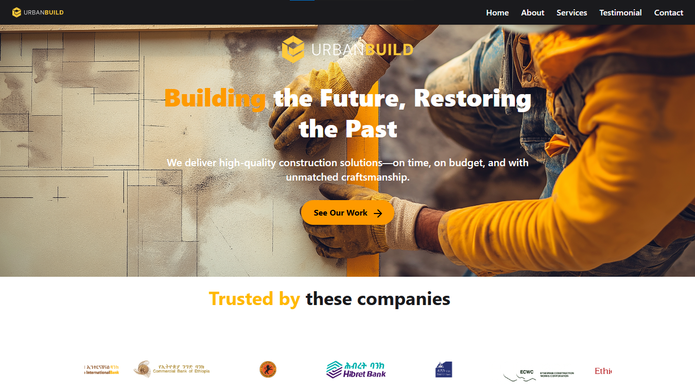

# Urban Build – Construction Company Website

## 📸 Preview



## Overview

Urban Build is a modern, responsive construction company website built with Next.js. It showcases construction services, company portfolio, and provides a seamless user experience with beautiful animations and professional design.
## ✨ Features

- 🏗️ Professional Construction Portfolio - Showcase of construction projects and services.
- 🎨 Modern UI/UX Design - Clean, professional layout with construction industry focus.
- ⚡ High Performance - Built with Next.js for optimal loading speeds.
- 📱 Fully Responsive - Perfect experience across all devices.
- 🎬 Smooth Animations - Engaging transitions with Framer Motion.


## 🛠️ Tech Stack

- **Frontend Framework**: Next.js 15
- **UI Library**: React 19
- **Type Safety**: TypeScript
- **Styling**: Tailwind CSS,shadcn/ui
- **Animations**: Framer Motion
- **Code Quality**: ESLint & Prettier


```

```

## 🚀 Getting Started

### Prerequisites

- Node.js 18+ installed
- pnpm or npm package manager
- Git

### Installation Steps

1. Clone the repository:

   ```sh
   https://github.com/Leulc21/Urban_Build.git
   ```

2. Navigate to the project directory:

   ```sh
   cd Urban
   ```

3. Install the dependencies:

   ```sh
   pnpm install
   ```

4. Start the development server:

   ```sh
   pnpm run dev
   ```

5. Open [http://localhost:3000](http://localhost:3000) in your browser

## 📝 License

This project is licensed under the MIT License - see the [LICENSE](LICENSE) file for details.

## 📞 Contact

For questions or feedback, reach out through:

- Email: leulchanie576@gmail.com
- Instagram: [@leulc21_type](https://www.instagram.com/leulch21?igsh=ejQ3OXRrMjE0NWxx)
- LinkedIn: [leulc1](https://www.linkedin.com/in/leul-chanie-7b10ba260?utm_source=share&utm_campaign=share_via&utm_content=profile&utm_medium=android_app)

---

Built with ❤️ by [Leul Chanie]
